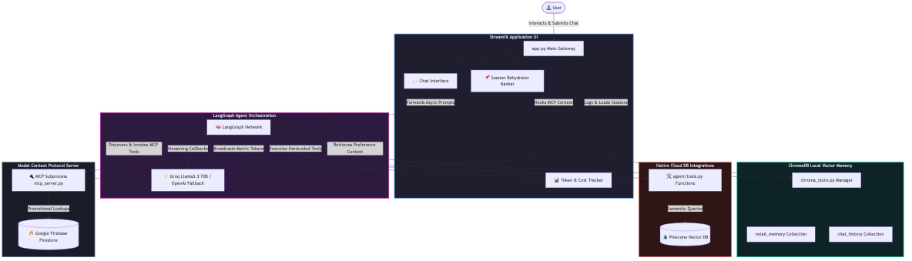

# 🏗️ Agentic Retail Architecture

This diagram visualizes the end-to-end data flow and logical architecture of the intelligent retail assistant platform built with LangGraph, Streamlit, and the Model Context Protocol (MCP).

### Component Breakdown
1. **Frontend**: The `app.py` process runs standard Streamlit components but routes its history architecture natively through standard markdown web anchor links. It also hooks an asynchronous callback event streamer to catch live cost metrics from LangGraph.
2. **Memory Store**: A completely isolated, local ChromaDB layer handles *both* semantic conversational retrieval (`retail_memory` collection) and isolated session logging (`chat_history` collection) so that users can resume old chat chains securely natively.
3. **Orchestration**: A `LangGraph` neural loop connects via asynchronous streaming to massive AI models (Groq `llama-3.3-70b-versatile`) while dynamically routing tools.
4. **Native Utilities**: Static python scripts (`pinecone_store.py`/`tools.py`) perform heavy cloud vector searches against the Pinecone index for immediate product recommendations and hard inventory details.
5. **MCP Extensibility**: The system boots up its own lightweight Model Context Protocol standalone JSON-RPC server (`mcp_server.py`) as a subprocess. This subserver establishes direct cloud connections into a `Firebase` instance and exposes those capabilities back dynamically to the LangGraph brain as live dynamic tools!
